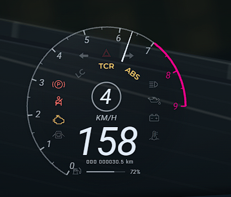
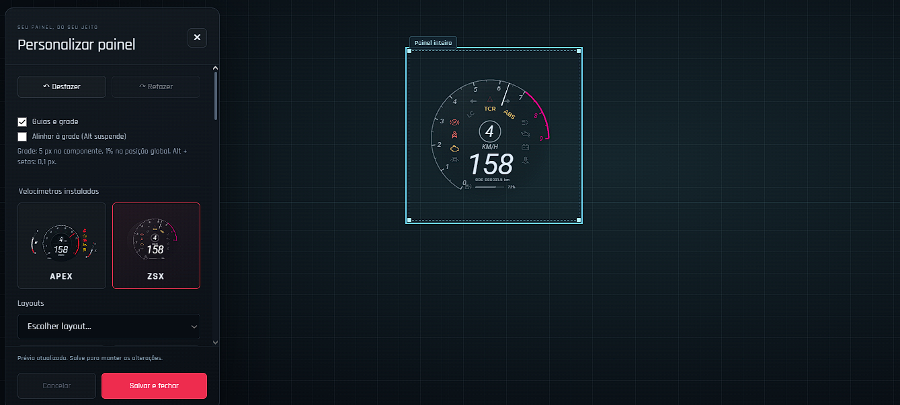
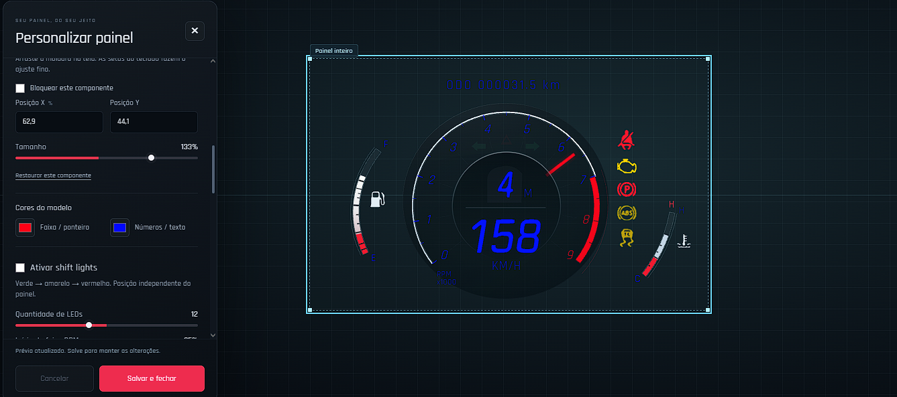
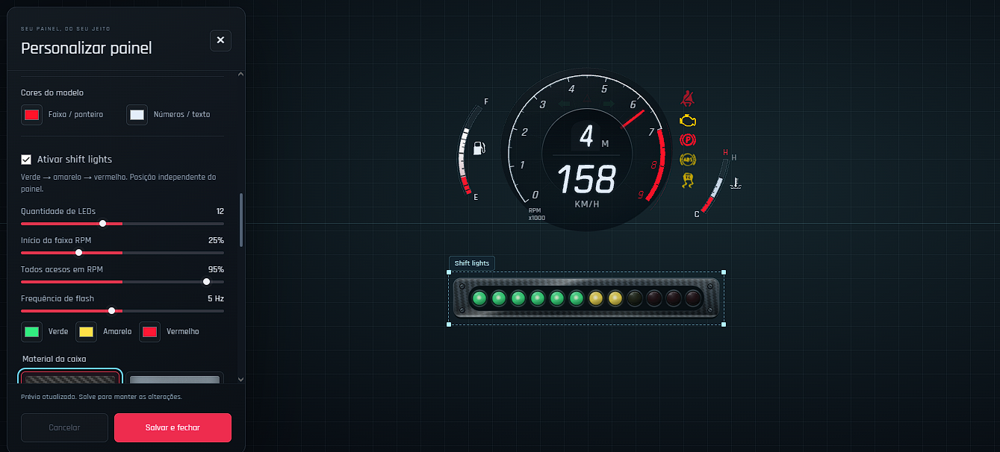
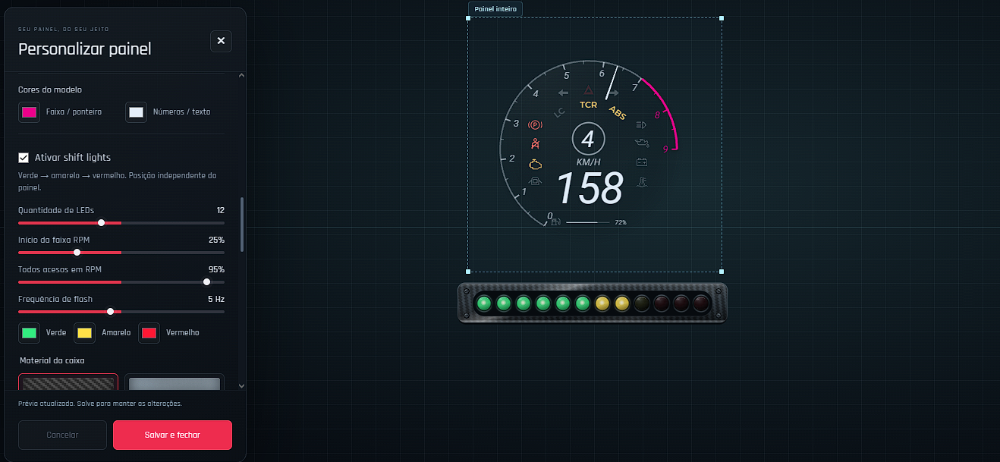
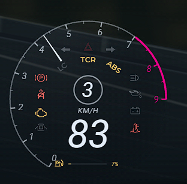
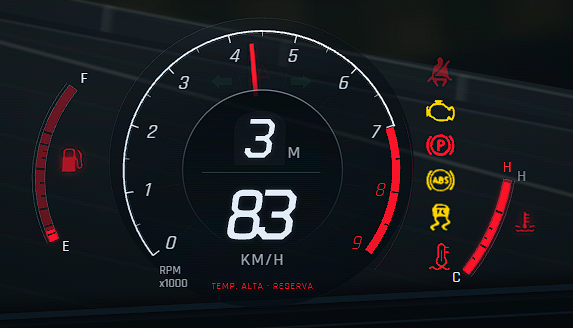

# Apex_Speedometer 4.0.0

## 📸 Preview

# Apex_Speedometer 4.0.0

Recurso único para FiveM com três painéis (APEX, ZSX e Caminhão), editor `/editvelo`, shift lights e prévia `DEV.html`. Suporta Qbox, QB-Core e modo standalone. O pacote deve ser instalado com o nome de pasta **`Apex_Speedometer`**.

## Instalação

1. Copie a pasta `Apex_Speedometer` para `resources` do servidor.
2. No `server.cfg`, inicie seu framework e recurso de combustível primeiro; depois adicione `ensure Apex_Speedometer`.
3. Remova as linhas antigas `ensure velo_core`, `ensure apex_speedometer` e `ensure zsx_speedometer` para não exibir painéis duplicados.
4. Abra `config.lua` para ajustar framework, unidades, combustível, cinto, perfis de veículos e comandos. O modo `Framework = 'auto'` detecta Qbox/QB-Core e usa standalone quando nenhum deles está ativo.

Os três layouts já vêm dentro de `speedometers/`. O `fxmanifest.lua` publica os arquivos da NUI, e o `client/models.lua` registra os três modelos. Não há dependência entre recursos de velocímetro. O editor permite alternar o modelo ativo e ajustar painel, componentes, vidro, cores, shift lights e viagem. `/apexhud` alterna a exibição; `/velodiag` imprime fontes e disponibilidade da telemetria no F8.

## Visualização e ajuste fino

Abra `DEV.html` no navegador para testar ignição, condução, luzes, combustível, temperatura e os três layouts sem entrar no jogo. O botão **Ajuste fino dos símbolos** abre uma prévia ampliada do caminhão. Arraste cada aviso ou texto livremente, ajuste X/Y e tamanho, edite rótulos estáticos e use **Copiar código** para compartilhar o JSON. O ajuste fica salvo somente no navegador; `speedometers/truck/web/layout-default.js` contém o posicionamento padrão usado no jogo. Códigos antigos `version: 1` a `version: 4` são convertidos ao importar para preservar posições e evitar que o novo padrão seja aplicado duas vezes.

No caminhão, a ignição sincroniza a varredura cromada dos cinco mostradores com a subida dos ponteiros e o autoteste das luzes. O câmbio pisca brevemente ao trocar de marcha; o aro de aviso pulsa no corte de RPM, combustível baixo ou temperatura alta. Os efeitos usam o mesmo quadro da telemetria, sem temporizadores extras, e obedecem à opção de animação, movimento reduzido do sistema e qualidade baixa.

## Telemetria e viagem

O recurso lê velocidade, RPM, marcha, combustível, temperatura e estados do veículo no cliente. Em `auto`, a temperatura recebe aquecimento visual gradual; use `Temperature.mode = 'native'` ou `VehicleState.temperatureKey` para uma leitura externa. O RPM nativo do GTA é normalizado de 0 a 1; `VehicleProfiles` define a escala de exibição por classe/modelo. O diagnóstico mostra o que está disponível e a origem de cada dado.

O odômetro mede distância **a partir desta instalação**, por modelo e placa, em KVP local do cliente. A autonomia é uma estimativa configurada em `Config.Trip.fullTankRangeKm` (padrão 400 km por tanque cheio), com sobrescritas por classe/modelo ou uma leitura externa por `rangeStateKey`. A ETA só aparece com rota GPS e velocidade suficiente. Não representa quilometragem histórica do GTA nem sincroniza entre jogadores. Renomear o recurso antigo para este pode mudar o escopo do KVP; exporte layouts antigos no editor antes da migração se quiser preservá-los.

Para acrescentar um painel, veja [SDK.md](SDK.md). As texturas usadas pela barra de LEDs e respectivas licenças estão em `web/assets/materials/`. `DEV.html` é apenas para prévia local e não é a página NUI do FiveM.
O odômetro representa a distância medida a partir desta instalação, não o histórico anterior do veículo. É local à instalação do FiveM; clientes diferentes não compartilham o registro e veículos com a mesma placa/modelo usam a mesma identidade. Uma placa vazia não é persistida. Gravações ocorrem a cada 30 segundos, ao trocar/sair do veículo e ao parar o recurso; um fechamento abrupto pode perder o trecho ainda não salvo. Não há alteração do motor, combustível ou handling.

